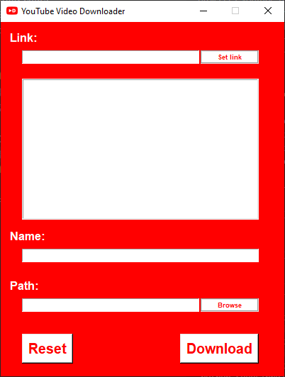
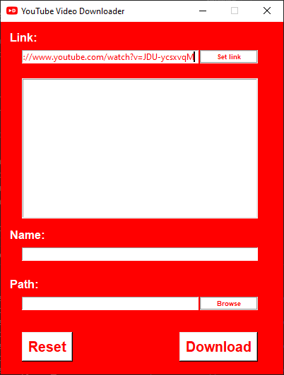
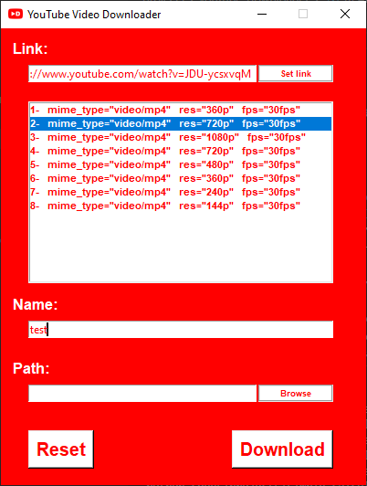
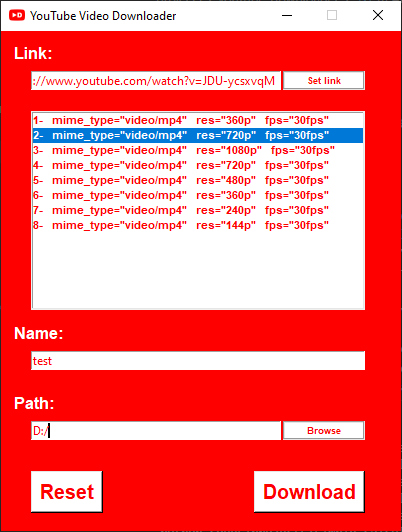

# YouTube Video Downloader
A simple application to download YouTube videos using Python.  
## Installation necessary libraries
This application uses the APIs tkinter for GUI and pytube for downloading YouTube videos.  
```
pip install pytube
pip install tkinter
```  
## Instructions to Run the Application
1. Run the **youtube_downloader.py** script.  
  
2. Enter the Link of the YouTube video.  
  
3. Click Set link button to show the Qualities.  
  
4. Select the Quality of the video that you want to download.  
  
5. Enter the name of the video.(*This is not mandatory*)  
  
6. Select the Location where you want to save the video.(*This is not mandatory*)  
  
7. Click Download button and wait till the video will get downloaded.  
  